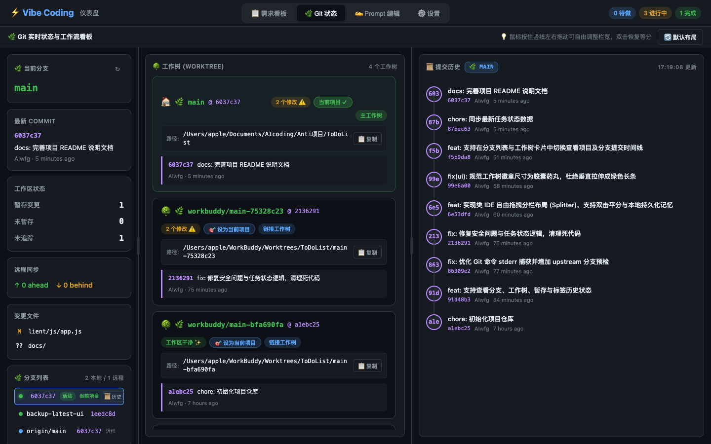
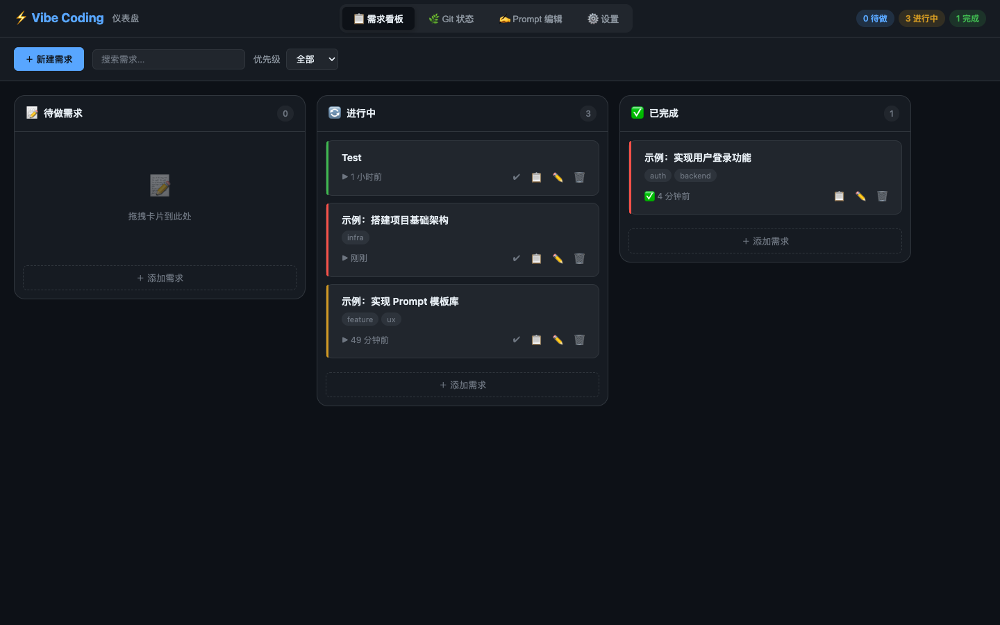
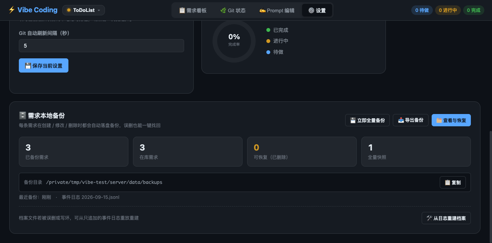

# ⚡ Vibe Coding 仪表盘 (Vibe Coding Dashboard)

专为 AI 辅助编程（Vibe Coding / Cursor / Claude Code / Codex）打造的本地轻量级可视化仪表盘。实时掌握项目开发进度、Git 多工作树状态、需求完成看板，并高效沉淀提示词（Prompt）。

无需安装任何第三方 npm 依赖 —— 采用 Node.js 原生内置模块驱动，开箱即用，极速轻量。

---

## 📸 界面预览

### 🌿 Git 状态与多工作树全景 (类 IDE 自由可拖拽分栏 & Worktree 穿梭)


### 📋 需求任务流看板 (Kanban)


### 🗄️ 需求本地备份与一键恢复


---

## ✨ 核心特性

- 🌿 **Git 状态与工作流全景**：
  - **类 IDE 自由分栏 (Splitter)**：分界线支持鼠标左右拖动，像素级自定义每栏宽度，双击自动 50:50 等分，`localStorage` 本地自动记忆；
  - **多工作树 (Git Worktree) 探测**：自动识别主工作树与所有链接工作树（如 WorkBuddy / Git Worktree），展开展示完整物理路径、最新提交与工作区干净度，支持一键复制路径与一键切换项目；
  - **分支与历史时间线穿梭**：点击分支列表即刻切换右侧「提交历史」时间线；分支若关联工作树，可一键切换为当前活动项目；
  - **实时自动感知**：每 5 秒自动轮询，文件修改、暂存、Commit 及远程 ahead/behind 状态实时更新。
- 📋 **需求看板 (Kanban)**：
  - 待做 / 进行中 / 已完成三栏，支持拖拽移动与任务统计；
  - 任务与 Prompt 深度联动，一键复制预置提示词发送给 AI。
- 🗄️ **需求本地备份（防丢失）**：
  - **自动落盘**：每条需求在「创建 / 修改 / 删除」时都会自动写入本地备份，无需手动操作；
  - **三层防护**：全量档案（按 id 去重，永不删除）+ 追加型事件日志（只追加不覆盖）+ 全量快照（可整体回滚）；
  - **误删可救**：需求被删除后数据本体仍保留在档案中，在设置页「查看与恢复」里一键找回；原项目已删除的需求也能兜底恢复；
  - **灾备重建**：档案文件被误删或写坏时，可从事件日志重放重建；
  - **内容级版本**：每条需求保留最近 20 个内容版本，Prompt 改错了也能翻回去。
- ✍️ **Prompt 编辑器**：
  - Markdown 实时分栏预览；
  - 内置 4 套经典 Prompt 模板（新功能开发 / Bug 修复 / 代码重构 / 单元测试编写）。
- ⚙️ **零依赖与极简架构**：
  - 无需 `npm install` 沉重依赖，纯 Node.js HTTP 原生开发，内存占用仅约 20MB；
  - 数据以标准 JSON 格式持久化在本地 `server/data/` 目录中。

---

## 🚀 快速启动

云端部署见 [Vercel 部署说明](docs/vercel.md)。本地版继续使用下方命令，数据与云端独立。

```bash
# 1. 启动服务 (需 Node.js >= 16)
npm start

# 2. 浏览器打开
open http://localhost:3333
```

> **安全说明**：服务仅监听 `127.0.0.1`，仅限本机访问。

---

## 🛠️ 首次使用配置

1. 启动后进入右上角 **⚙️ 设置**；
2. 点击 **📂 浏览选择** 或手动填入本地 Git 仓库路径（例如 `/Users/yourname/my-project`）；
3. 保存后切换至 **🌿 Git 状态** 即可开始体验！

---

## 📁 数据存储

- `server/data/tasks.json` —— 看板需求与待办数据
- `server/data/projects.json` —— 多项目列表与当前激活项目
- `server/data/boards/<项目id>.json` —— 各项目的看板数据（物理隔离）
- `server/data/config.json` —— 项目路径与本地配置（已加入 `.gitignore`，安全防泄露）

### 🗄️ 备份目录（`server/data/backups/`）

| 文件 | 作用 |
| --- | --- |
| `task-archive.json` | 全量档案：按需求 id 去重，永远保留每条需求的最新内容 + 历史版本；删除仅打标记，数据不删 |
| `journal/YYYY-MM-DD.jsonl` | 追加型事件日志：逐条记录每次 `created` / `updated` / `deleted`，只追加不覆盖 |
| `snapshots/*.json` | 全量快照：所有看板的完整快照，启动时自动生成，也支持手动触发（保留最近 60 份） |

备份说明：

- 服务启动时会自动把看板中已有但尚未备份的需求**回填**进档案，无需担心「启用备份前」的数据；
- 档案与快照均采用**原子写**（先写临时文件再 rename），避免写到一半进程退出导致备份文件损坏；
- 恢复时若需求**原来的项目已被删除**，会自动兜底到当前项目，并提示实际落点——不会出现「备份里有、却永远恢复不出来」的死角；
- **灾备重建**：档案文件万一被误删或写坏，可从只追加的事件日志重放重建（重建前会自动把旧档案另存一份，可追溯）；
- 设置页可直接查看备份状态、手动全量备份、导出备份（含档案 + 当前所有看板）、一键恢复与从日志重建。

### 🔧 备份相关接口

| 接口 | 说明 |
| --- | --- |
| `GET /api/backups` | 备份概览（条数、目录、日志与快照统计） |
| `GET /api/backups/archive` | 档案列表（按最近备份时间倒序），支持 `q` 搜索、`deleted=1` 只看已删除 |
| `GET /api/backups/journal?date=` | 读取某天的事件日志 |
| `POST /api/backups/restore` | 从档案恢复需求（`{ task_id, project_id? }`） |
| `POST /api/backups/snapshot` | 手动生成全量快照 |
| `GET /api/backups/export` | 导出全部备份（档案 + 项目 + 看板） |
| `GET /api/backups/rebuild` | 预览：从日志重放能重建出什么（不落盘） |
| `POST /api/backups/rebuild` | 执行重建（旧档案自动另存） |
